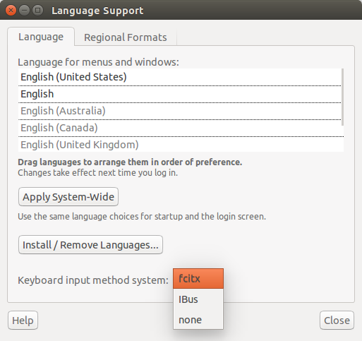
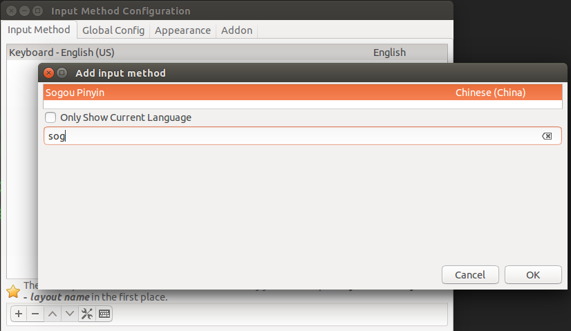
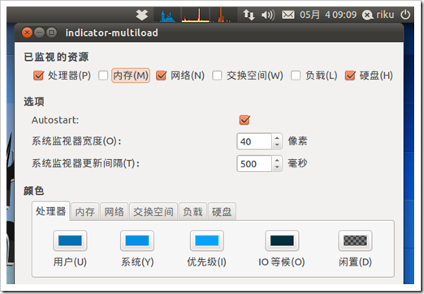
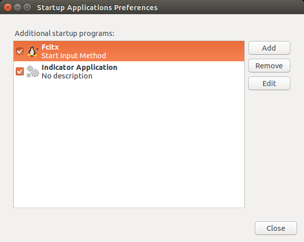
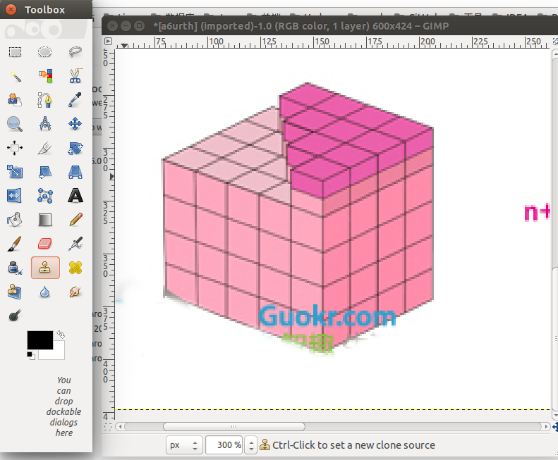

[TOC]

### 制作U盘启动

1、查看U盘的卷标，并卸载U盘

`sudo fdisk -l`

`sudo umount /dev/sdb1`

2、写入系统镜像到U盘

`sudo dd if=./ubuntu-13.04-beta2-desktop-amd64.iso   of=/dev/sdb`


### Ubuntu安装搜狗输入法

1、到https://pinyin.sogou.com/linux/下载deb包

2、通过Ubuntu软件中心打开，点击安装（或者`dpkg -i sogoupinyin_2.2.0.0102_amd64.deb`）

3、把键盘输入设置为fcitx，依次打开右上角（System Settings）系统设置->（Language Support）语言支持->（Keyboard input method system）键盘输入方式系统，选择fcitx

 

4、在Dash（按Windows键）搜索fcitx，打开fcitx configuration，输入法配置中点击那个`+`加号，去掉勾选“Only show current Language” ，然后搜索框输入sog，添加搜狗拼音，点击上下箭头把搜狗拼音移动到第一位，作为默认的输入法。最后logout（注销），重新登录就可以在屏幕上面看到搜狗输入法图标了

 


### Ubuntu配置国内源

说明

```
Universe：没有官方维护的开源软件
Main：官方维护的开源软件
Mulitverse：非官方维护的非开源软件（具有版权或限制使用）
Restricted：官方维护的非开源软件
Source Code：源代码
```

以下指针对Ubuntu14.04，任意选择一个添加到`/etc/apt/sources.list`然后执行`sudo apt-get update`刷新源列表就行

`sudo gedit /etc/apt/sources.list`

`sudo apt-get update`

```
##阿里
deb http://mirrors.aliyun.com/ubuntu/ trusty main restricted universe multiverse
deb http://mirrors.aliyun.com/ubuntu/ trusty-security main restricted universe multiverse
deb http://mirrors.aliyun.com/ubuntu/ trusty-updates main restricted universe multiverse
deb http://mirrors.aliyun.com/ubuntu/ trusty-proposed main restricted universe multiverse
deb http://mirrors.aliyun.com/ubuntu/ trusty-backports main restricted universe multiverse
deb-src http://mirrors.aliyun.com/ubuntu/ trusty main restricted universe multiverse
deb-src http://mirrors.aliyun.com/ubuntu/ trusty-security main restricted universe multiverse
deb-src http://mirrors.aliyun.com/ubuntu/ trusty-updates main restricted universe multiverse
deb-src http://mirrors.aliyun.com/ubuntu/ trusty-proposed main restricted universe multiverse
deb-src http://mirrors.aliyun.com/ubuntu/ trusty-backports main restricted universe multiverse

##网易
deb http://mirrors.163.com/ubuntu/ trusty main restricted universe multiverse
deb http://mirrors.163.com/ubuntu/ trusty-security main restricted universe multiverse
deb http://mirrors.163.com/ubuntu/ trusty-updates main restricted universe multiverse
deb http://mirrors.163.com/ubuntu/ trusty-proposed main restricted universe multiverse
deb http://mirrors.163.com/ubuntu/ trusty-backports main restricted universe multiverse
deb-src http://mirrors.163.com/ubuntu/ trusty main restricted universe multiverse
deb-src http://mirrors.163.com/ubuntu/ trusty-security main restricted universe multiverse
deb-src http://mirrors.163.com/ubuntu/ trusty-updates main restricted universe multiverse
deb-src http://mirrors.163.com/ubuntu/ trusty-proposed main restricted universe multiverse
deb-src http://mirrors.163.com/ubuntu/ trusty-backports main restricted universe multiverse

##兰州大学
deb http://mirror.lzu.edu.cn/ubuntu/ trusty main multiverse restricted universe
deb http://mirror.lzu.edu.cn/ubuntu/ trusty-backports main multiverse restricted universe
deb http://mirror.lzu.edu.cn/ubuntu/ trusty-proposed main multiverse restricted universe
deb http://mirror.lzu.edu.cn/ubuntu/ trusty-security main multiverse restricted universe
deb http://mirror.lzu.edu.cn/ubuntu/ trusty-updates main multiverse restricted universe
deb-src http://mirror.lzu.edu.cn/ubuntu/ trusty main multiverse restricted universe
deb-src http://mirror.lzu.edu.cn/ubuntu/ trusty-backports main multiverse restricted universe
deb-src http://mirror.lzu.edu.cn/ubuntu/ trusty-proposed main multiverse restricted universe
deb-src http://mirror.lzu.edu.cn/ubuntu/ trusty-security main multiverse restricted universe
deb-src http://mirror.lzu.edu.cn/ubuntu/ trusty-updates main multiverse restricted universe


```
http://ftp.sjtu.edu.cn/sites/archive.ubuntu.com


### 刚装完Ubuntu后需要安装哪些软件？

**deb、tar.gz安装包**

1、Typora （deb）

2、Chrome （deb，包括AdblockPlus插件、flashplayer插件、截长图插件）

3、Teamviewer（deb）

4、VirtualBox（deb）

5、WPS（deb）

6、InteliJ IDEA（tar.gz）


**apt方式在线安装**

```
sudo apt-get install -y git
sudo apt-get install -y vim
sudo apt-get install -y meld 
sudo apt-get install -y shutter
sudo apt-get install -y nautilus-open-terminal  ##右键菜单加入open tab（打开标签页）

sudo apt-get install -y mysql-server mysql-client libmysqlclient-dev
sudo apt-get install -y mysql-workbench

sudo add-apt-repository ppa:indicator-multiload/stable-daily
sudo apt-get update
sudo apt-get install indicator-multiload     ##监控插件

```

 


**可选软件**

GIMP P图工具

Kazam 录屏工具

kdenlive 视频剪辑


### Ubuntu设置软件开机启动

1、进程开机启动把启动命令加入  `/etc/rc.d/rc.local` 文件

2、启动命令加入到用户登录时要执行的文件 （按照先后顺序，只执行最先找到的一个）

`/ect/profile` >  `$HOME/.bash_profile` >  `$HOME/.bash_login` >  `$HOME/.profile`

3、Dash（按Windows键）输入startup，在终端输入命令

`gnome-session-properties`

 


### Ubuntu Chrome无法播放视频，需要安装flashplayer

1、到https://get.adobe.com/cn/flashplayer/?no_redirect 下载tar.gz（flash_player_ppapi_linux.x86_64.tar.gz）


2、到`$HOME/.config/google-chrome/PepperFlash/`目录下创建一个Chrome版本号文件夹（例如56.0.2924.87）


 


3、把tar.gz解压之后的文件放到版本号文件夹

 


4、修改chrome的desktop文件

 `sudo gedit /usr/share/applications/google-chrome.desktop`

 把Exec部分修改成如下内容，注意`/home/jh`改为自己的，且不能使用`$HOME`，两处版本号与前面创建文件夹一致。

```
Exec=/usr/bin/google-chrome-stable %U --ppapi-flash-path=/home/jh/.config/google-chrome/PepperFlash/56.0.2924.87/libpepflashplayer.so --ppapi-flash-version=56.0.2924.87
```

 


5、重启Chrome浏览器


### 使用GIMP去除水印

视频演示：http://www.uupoop.com/help/12535.html

1.打开一张图片 

2.选择图章工具，鼠标移到图片上。 

3.按住Ctrl键，点击鼠标选择复制源点，选择合适的源点很 重要。 

4.松开Ctrl键，点击水印，这时源点就被复制到水印上盖住 水印了。 

5.重复3和4步骤，把水印慢慢覆盖。如果点错了，可以在历史记录里返回上一步。

 

另外，

1、如果工具栏不见了，在Windows菜单下面新建一个toolbox（New ToolBox）

2、GIMP默认保存的是cfx格式，如果需要png或者jpg格式，需要导出（Export）


### Ubuntu 新建桌面图标文件示例

desktop文件路径`/usr/share/applications/`

```
[Desktop Entry]
Name=Typora
Comment=a minimal Markdown reading & writing app. 
GenericName=Markdown Editor
Exec=/path/typora %U
Icon=/path/typora
Type=Application
StartupNotify=true
Categories=Office;WordProcessor;
MimeType=text/markdown;text/x-markdown;
```

