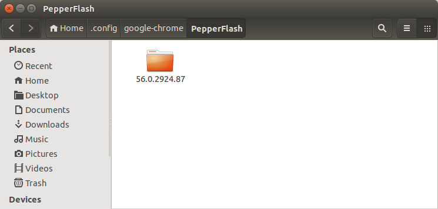
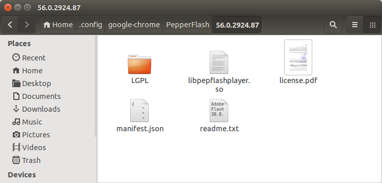
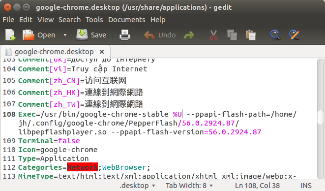

### Ubuntu Chrome无法播放视频，需要安装flashplayer

1、到https://get.adobe.com/cn/flashplayer/?no_redirect 下载tar.gz（flash_player_ppapi_linux.x86_64.tar.gz）


2、到`$HOME/.config/google-chrome/PepperFlash/`目录下创建一个Chrome版本号文件夹（例如56.0.2924.87）


 


3、把tar.gz解压之后的文件放到版本号文件夹

 


4、修改chrome的desktop文件

 `sudo gedit /usr/share/applications/google-chrome.desktop`

 把Exec部分修改成如下内容，注意`/home/jh`改为自己的，且不能使用`$HOME`，两处版本号与前面创建文件夹一致。

```
Exec=/usr/bin/google-chrome-stable %U --ppapi-flash-path=/home/jh/.config/google-chrome/PepperFlash/56.0.2924.87/libpepflashplayer.so --ppapi-flash-version=56.0.2924.87
```

 


5、重启Chrome浏览器


### 使用GIMP去除水印


另外GIMP默认保存的是cfx格式，如果需要png或者jpg格式，需要导出（Export）


